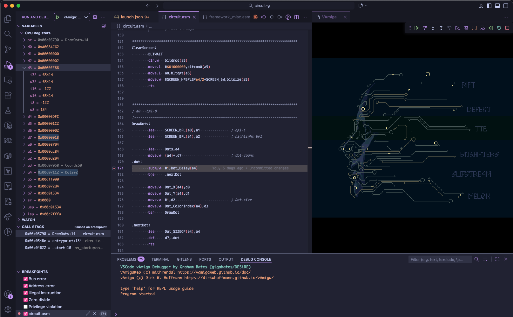
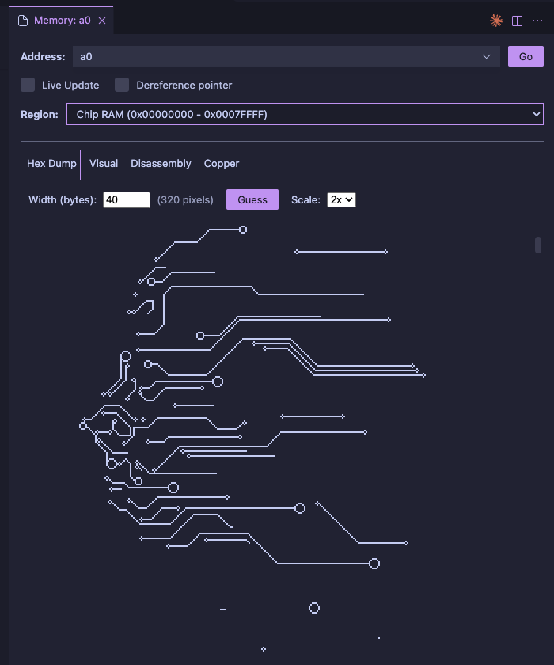
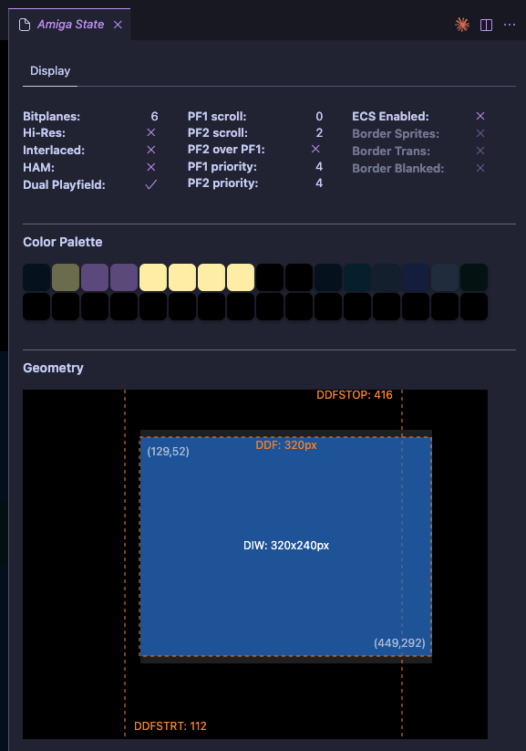
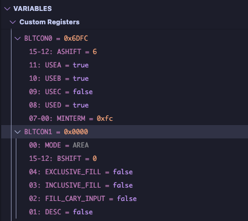
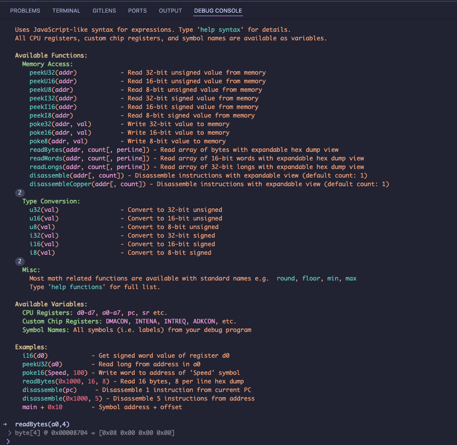

# vAmiga Debugger

Debug Amiga programs with an integrated VAmiga emulator in vscode.

## Why?

While there are already [great](https://marketplace.visualstudio.com/items?itemName=prb28.amiga-assembly) [extensions](https://marketplace.visualstudio.com/items?itemName=BartmanAbyss.amiga-debug) for developing Amiga programs in VS Code, this is intended to fill a specific niche, and take advantage of the possibilities offered by directly integrating the emulator in the editor.

- Loading the program directly into Amiga RAM offers near instant startup times, allowing for fast iteration
- We can introduce realtime visual representations of the Amiga state along the lines of [Coppenheimer](https://heckmeck.de/amigastyle/coppenheimer/), all while having access to debug symbols to interpret the running program.
- No need for platform specific emulator binaries, and the compatibility issues this leads to.

## Getting started

You can use this debugger with any Amiga hunk executable built with debug symbols using the `-linedebug` option in vasm.

You'll need an extension which includes a `m68k` language provider, such as my own [Motorola 68000 Assembly extension](https://marketplace.visualstudio.com/items?itemName=gigabates.m68k-lsp), or [Amiga Assembly](https://marketplace.visualstudio.com/items?itemName=prb28.amiga-assembly) if you already use that.

Simply add a new debug launch config to your project using one of the vAmiga configuration snippets provided, and adjust the paths to your Amiga executable and ROMs in the current workspace.

## Limitations

Essentially, all limitations of VAmiga itself apply, and this extension does not support AGA or processors above 68020.  No WinUAE specific functions such as logging or controlling warp mode are supported.

While it is possible to debug C programs, with experimental support for ELF symbols, this is extension is really better suited for assembly programming.

## Features

### Fast load

The `fastLoad` option in the debug config enables a mode where the program is directly injected into memory, rather than emulating loading it from disk. This gives much faster startup times, at the cost of a few limitations. The startup will be faster still if you leave the vAmiga emulator window open between debug sessions, and allow the debugger to reuse it.

Things to note:
- It does update the memory structures in exec, as if the OS had allocated the memory, so further OS allocations should still work.
- Most system shutdown code should still work
- Exiting the program to the OS will crash, because we inject the program very early in the boot sequence, and there's no DOS prompt to exit to

### Memory Viewer

You can view the memory at a given address in one of four formats:
- Hex dump
- Visual bitmap view, inspired by [Coppenheimer](https://heckmeck.de/amigastyle/coppenheimer/)
- CPU disassembly
- Copper disassembly

You can open the memory viewer by:
- right clicking on a symbol name in the variables list
- clicking the icon in the debug toolbar
- 'VAmiga: Open Memory Viewer' from the command palette

The address input can be a numeric address, or an expression including symbols or register names.

### Amiga state

This gives a GUI representation of various Amiga internal state. Currently this includes the screen setup and palette info, but more visualisations are planned.
You can open the view by clicking the icon in the debug toolbar or 'VAmiga: Open Memory Viewer' from the command palette.

### Detailed variables list

Beyond the usual register and symbol lists, many of the variables expand to give detailed info of bits and ranges set, and potential signed/unsigned interpretations of registers. Where an address equates to an offset from a know symbol this is also annotated.

### Repl console

The debug console can be used to evaluate expressions and read or write the emulator internal state. It uses a JavaScript-like syntax, with access to register and symbol variables, and various helper functions.

### Reverse stepping

The debugger supports stepping backwards to previous points where the emulator was stopped. While this isn't full time-travel debugging where the program can be run entirely in reverse, it does act as an undo button for stepping forwards in the code. It works by taking a snapshot each time the emulator stops.